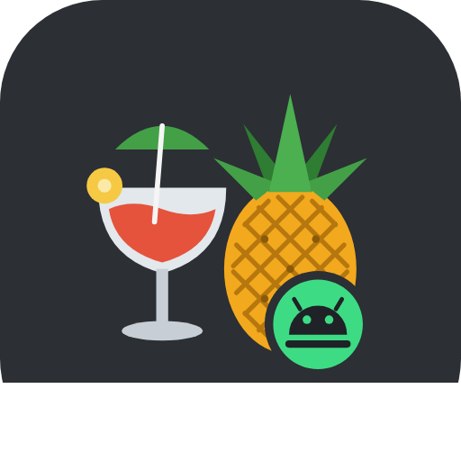

<p align="center"></p>

# HandDroid

**HandDroid** is an Android video converter *based on [HandBrake](https://handbrake.fr)*. It keeps what makes HandBrake
useful – a fast MP4 / MKV / WebM converter that reads almost any codec, driven either by **presets** or by detailed
settings – and brings it to Android in a modern Material 3 Expressive interface (minimalist grey/white, with a grey/black dark mode).

> HandDroid is an independent project. It is **not** affiliated with or endorsed by the HandBrake Team.
> HandBrake is © 2003–2026 HandBrake Team, licensed under the GNU GPL v2.

* Package: `com.galandras12.unofficialhandbrake` · Version: **1.0.1** · Min Android 8.0 (API 26)
* License: **GNU General Public License v2** (see [`LICENSE`](LICENSE) and [`NOTICE.md`](NOTICE.md))

## Features

* **Presets** – HandBrake's own presets (General, Web, Devices, Matroska, Production) converted for the Android engine,
  plus fast **hardware (MediaCodec)** presets and your own saved presets.
* **Detailed settings** in HandBrake's familiar tabs: *Summary · Video · Audio · Subtitles · Picture · Filters*
  * Video: H.264 (x264), H.265 / H.265 10-bit (x265), VP9, AV1 (libaom), Android hardware H.264 / H.265;
    constant quality (RF) or average bitrate, 2-pass, encoder preset slider, profile / level / tune / extra options,
    constant / peak / variable framerate
  * Audio: AAC, Opus, MP3, AC-3, E-AC-3, FLAC, Vorbis or auto passthru; mixdown, bitrate, sample rate, gain; first or all tracks
  * Subtitles: soft subtitles (MP4 `mov_text`, MKV copy)
  * Picture: max resolution, crop, rotate / flip. Filters: deinterlace (decomb / yadif / bwdif), denoise, sharpen, grayscale
  * Chapter markers, Web optimized (fast-start) MP4
* **Queue** with progress, FPS, speed and ETA; runs as a foreground service so encodes continue with the screen off; activity log per job.
* Batch conversion (pick several videos), *Share → HandDroid* from other apps, saves to `Movies/HandDroid` or a folder you choose.
* **12 languages**, chosen automatically from the phone's language (English, Magyar, Deutsch, Français, Español, Italiano, Português, Polski, Русский, Türkçe, 日本語, 中文) with an in-app override and **automatic on-device translation (Google ML Kit)** for every other language the phone is set to, (also listed in Android 13+ per-app language settings); light / dark / system theme.

## How it works – and how it differs from HandBrake

HandBrake's conversion engine (`libhb`) is a large C library whose build system targets Linux, macOS and Windows.
It has no Android toolchain, so HandDroid does **not** embed `libhb`. Instead, like HandBrake itself, it builds on
**FFmpeg**, x264, x265, libvpx and libaom, using the maintained
[`ffmpeg-kit-full-gpl`](https://central.sonatype.com/artifact/com.antonkarpenko/ffmpeg-kit-full-gpl) build for Android.
HandBrake's presets and the structure of its settings are translated into FFmpeg command lines by
[`CommandBuilder`](app/src/main/java/com/galandras12/unofficialhandbrake/engine/CommandBuilder.kt).

Things HandBrake can do that HandDroid 1.0.1 cannot (yet): DVD / Blu-ray disc sources, burned-in subtitles, SVT-AV1
(libaom is used for AV1), HDR10/Dolby Vision metadata handling and tone mapping, auto-crop, per-track audio settings.
10-bit / HDR sources are converted to SDR 4:2:0 unless a 10-bit encoder is selected.

## Building

Requirements: JDK 17+, Android SDK (platform 35). The Gradle wrapper downloads everything else.

```sh
./gradlew assembleDebug        # app/build/outputs/apk/debug/app-debug.apk
./gradlew testDebugUnitTest    # command builder tests
```

Release signing is read from the environment: `HANDDROID_KEYSTORE`, `HANDDROID_KEYSTORE_PASSWORD`,
`HANDDROID_KEY_ALIAS`, `HANDDROID_KEY_PASSWORD`.

### Tools

| Script | Purpose |
|---|---|
| `tools/convert_presets.py` | Converts HandBrake's `preset/preset_builtin.json` to `app/src/main/assets/presets.json` |
| `tools/gen_strings.py` | Generates every language's `strings.xml`, `locales_config.xml` and `Languages.kt` from `tools/i18n/*.txt` (checks for missing keys and placeholder mismatches) |
| `tools/gen_logo.py` | Draws the logo and writes the vector drawables / `docs/logo.svg` |
| `tools/validate_commands.py` | Runs every generated command line against a desktop `ffmpeg` as a sanity check |

## Credits

HandBrake © HandBrake Team · FFmpeg · FFmpegKit · x264 · x265 · libvpx · libaom · Opus · LAME · Vorbis ·
Jetpack Compose / Material 3. The Android robot head in the logo is a simplified redrawing in the spirit of the
Android logo (CC BY 3.0, Google).

## Automatic translation for other languages

If the phone (or the in-app picker) uses a language the app doesn't ship, HandDroid translates its English texts on the
device with [Google ML Kit Translation](https://developers.google.com/ml-kit/language/translation) (59 languages). A small
language pack is downloaded once (internet needed), the result is cached, and the interface restarts in that language.
If it fails, the app simply stays in English. Notifications are translated too, but only the app's own texts: HandBrake
preset names stay English.

## Adding a language

1. Copy `tools/i18n/de.txt` to `tools/i18n/<tag>.txt` and translate the text after each ` = `.
2. Add the language to `LANGS` in `tools/gen_strings.py` and to `localeFilters` in `app/build.gradle.kts`.
3. Run `python3 tools/gen_strings.py app/src/main/res app/src/main/java/com/galandras12/unofficialhandbrake/ui`.

HandBrake preset names and descriptions are kept in English, as in HandBrake itself.
